# Пошаговое руководство: полный рабочий день в Nika CRM

Сценарий «от входа до сведения кассы»: создание заявки → услуги и товары → оплата → закрытие → начисление и выплата зарплаты → проверка кассы и отчётов.

**Версия:** 1.0  
**Дата:** 2026-07-27  
**Связанный документ:** [USER_GUIDE.md](USER_GUIDE.md) (справочник по всем разделам)

> **Скриншоты.** В тексте стоят места под реальные снимки экрана (`docs/assets/walkthrough/`).  
> Их можно снять скриптом [`scripts/capture_walkthrough_screenshots.py`](../scripts/capture_walkthrough_screenshots.py) на работающей CRM (локально или демо) — см. раздел [Скриншоты](#скриншоты) в конце.

---

## Содержание

0. [Подготовка](#0-подготовка)
1. [Вход в систему](#1-вход-в-систему)
2. [Создание заявки](#2-создание-заявки)
3. [Добавление услуг и товаров](#3-добавление-услуг-и-товаров)
4. [Проводка платежа по заявке](#4-проводка-платежа-по-заявке)
5. [Смена статусов и закрытие заявки](#5-смена-статусов-и-закрытие-заявки)
6. [Печать документов](#6-печать-документов)
7. [Начисление зарплаты](#7-начисление-зарплаты)
8. [Выплата зарплаты](#8-выплата-зарплаты)
9. [Касса: движение денег](#9-касса-движение-денег)
10. [Сводка дня и отчёты](#10-сводка-дня-и-отчёты)
11. [Дополнительно: магазин, закупки, чат](#11-дополнительно-магазин-закупки-чат)
12. [Чек-лист конца дня](#12-чек-лист-конца-дня)

---

## 0. Подготовка

**Кто проходит сценарий:** менеджер / admin с правами на заявки, склад, кассу, зарплату и отчёты.

**Демо-учётки OSS / Windows SETUP** (пароль `111111`): `admin`, `manager`, `master`, `viewer`.  
На публичном демо смотрите логин на лендинге (например `demo_admin`).

**Перед стартом проверьте в Настройках (admin):**

| Что | Где | Зачем |
|-----|-----|--------|
| Есть статусы «В работе», «Готова», «Закрыта» (или ваши аналоги) | Настройки → Статусы заявок | Жизненный цикл заявки |
| У закрывающего статуса включено **«Начисляет зарплату»** | тот же раздел | Иначе ЗП не начислится при закрытии |
| При необходимости **«Вызывает окно оплаты»** | тот же раздел | Напомнит принять оплату при закрытии |
| Режим печати при закрытии | Настройки → Общие → `close_print_mode` | `choice` = выбор чек/акт |
| На складе есть товар с остатком | Склад → Товары | Иначе запчасть не добавится |
| В справочнике есть услуги | Настройки → Услуги | Для блока услуг |

---

## 1. Вход в систему

### Шаги

1. Откройте адрес CRM (локально: `http://127.0.0.1:5000`, демо: `https://demo.nika-sc.ru/`).
2. Если открылся лендинг — нажмите **«Войти в демо»** / **«Войти»** (или перейдите на `/login`).
3. Введите **имя пользователя** и **пароль**.
4. Нажмите **«Войти»**.

Вы попадаете на дашборд (или список заявок — в зависимости от роли и настроек).

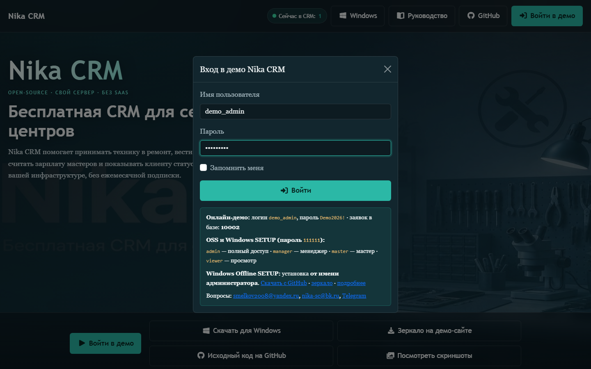

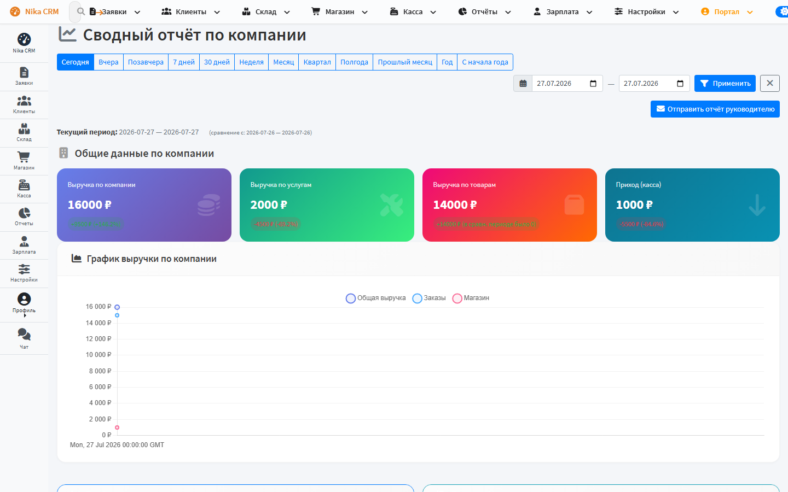

### Если не получается

- Неверный пароль / раскладка / Caps Lock.
- HTTPS «висит» у провайдера — попробуйте другую сеть или мобильный интернет.
- У `viewer` мало пунктов меню — для полного сценария нужен `admin` или `manager`.

---

## 2. Создание заявки

### Путь в меню

**Заявки** → **Новая заявка** → URL `/add_order`

### Шаги

1. Откройте форму новой заявки.
2. Заполните блок **клиента**:
   - ФИО (обязательно);
   - телефон / email (по правилам формы);
   - можно выбрать существующего клиента из поиска, если поле это поддерживает.
3. Заполните блок **устройства**:
   - тип, бренд, модель (часто с автоподстановкой);
   - серийный номер, пароль устройства — по необходимости;
   - неисправность, внешний вид.
4. Укажите **менеджера** и **мастера** (если поля есть).
5. При необходимости предоплату и способ (Наличные / Перевод).
6. Комментарий приёма — кратко.
7. Нажмите **«Сохранить заявку»**.

Откроется **карточка заявки** `/order/<id>`.

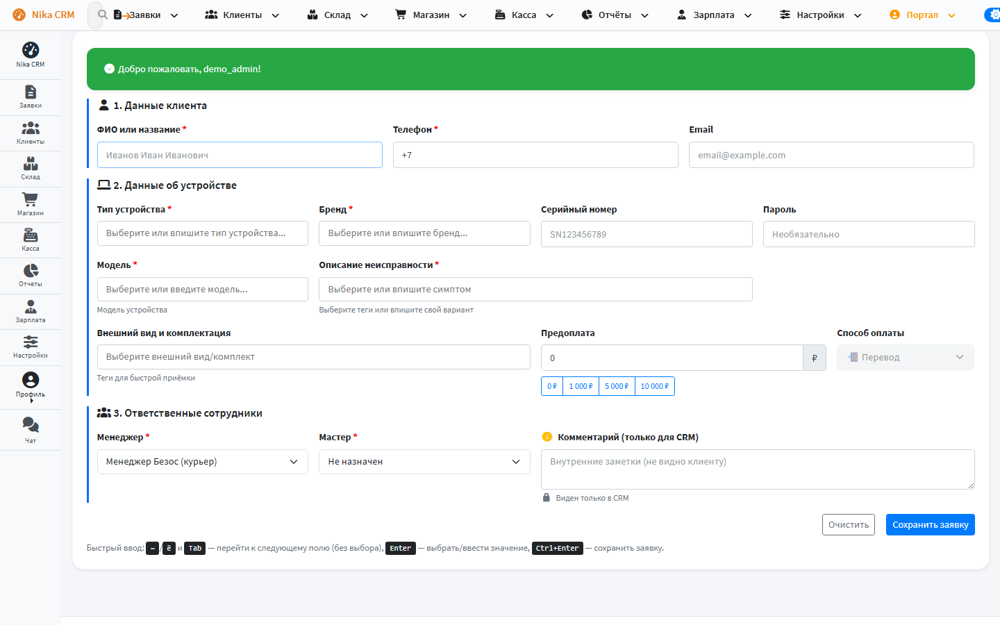


### На что обратить внимание

- Клиент и устройство сохраняются в базе и пригодятся для портала клиента.
- Предоплата обычно сразу уходит в кассу (как оплата) — проверьте позже в § 9.

---

## 3. Добавление услуг и товаров

На карточке заявки найдите блок **«Товары и услуги»** (название может быть «Услуги / Запчасти»).

### 3.1. Услуга

1. Нажмите **«Добавить»** (или **«Добавить услугу»**).
2. В модальном окне откройте список **«Услуги»**.
3. Найдите услугу поиском, укажите количество и цену при необходимости.
4. Подтвердите добавление.

Сумма заявки увеличится на стоимость работ.

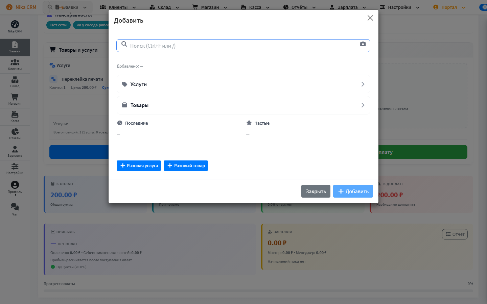

### 3.2. Товар / запчасть со склада

1. Снова **«Добавить»** → **«Товары»** (или **«Добавить запчасть»**).
2. Найдите позицию по названию / артикулу.
3. Укажите количество.
4. Подтвердите.

**Важно:** количество **списывается со склада**. Если остатка нет — система покажет ошибку. Сначала оприходуйте товар (Склад → Товары / Закупки).

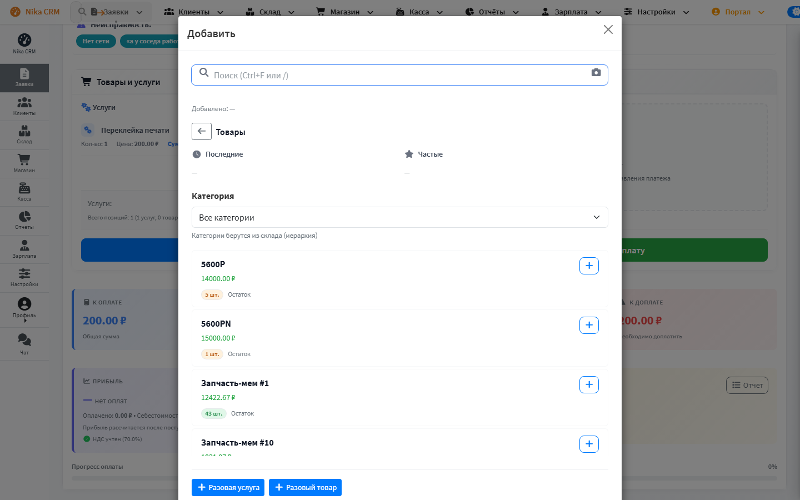

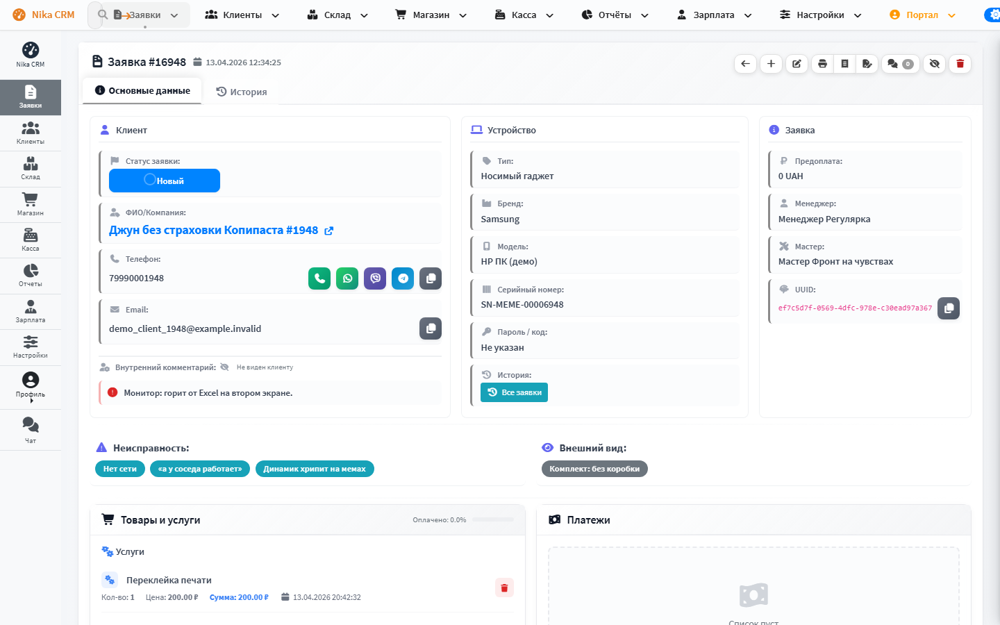

---

## 4. Проводка платежа по заявке

### Путь

Карточка заявки → блок **«Платежи»** (или **«Оплаты»**).

### Шаги

1. Нажмите **«Добавить оплату»**.
2. Укажите:
   - **сумму**;
   - **тип**: Наличные / Перевод (и др. варианты в списке);
   - комментарий (опционально).
3. Нажмите **«Сохранить»**.

Создаётся платёж по заявке и связанная операция в **Кассе**. Прогресс оплаты на карточке обновляется (не больше 100% в индикаторе).

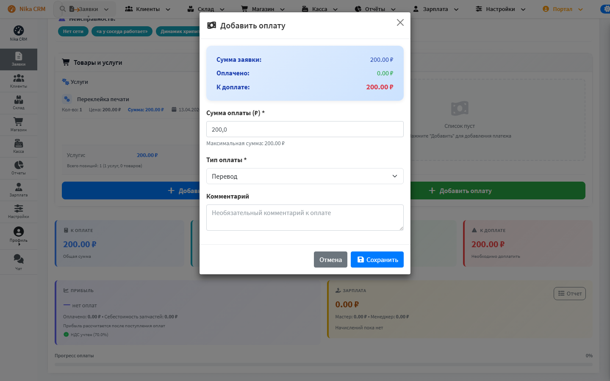

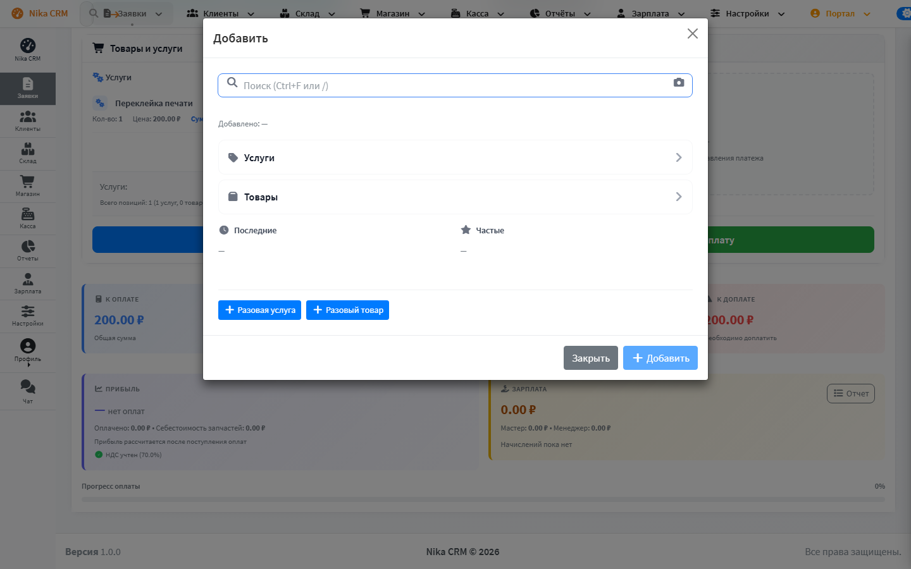

### Возврат (если нужно)

У строки оплаты → **«Возврат»** → сумма ≤ остатку → причина → подтвердить. В кассе появится расход.

---

## 5. Смена статусов и закрытие заявки

### Рекомендуемый жизненный цикл

```
Новая → В работе → Готова → Закрыта
```

(Имена статусов могут отличаться — смотрите **Настройки → Статусы**.)

### Шаги

1. На карточке нажмите цветную кнопку **текущего статуса**.
2. Выберите **«В работе»** — мастер приступил.
3. Позже выберите **«Готова»** — можно звонить клиенту.
4. Когда клиент забрал устройство и рассчитался — выберите **«Закрыта»** (или ваш закрывающий статус).

При закрытии система может:

- показать окно доплаты/оплаты (если у статуса флаг **«Вызывает окно оплаты»**);
- **начислить зарплату** мастеру/менеджеру (если флаг **«Начисляет зарплату»**) — toast вроде «Зарплата начислена»;
- открыть выбор печати (см. § 6).


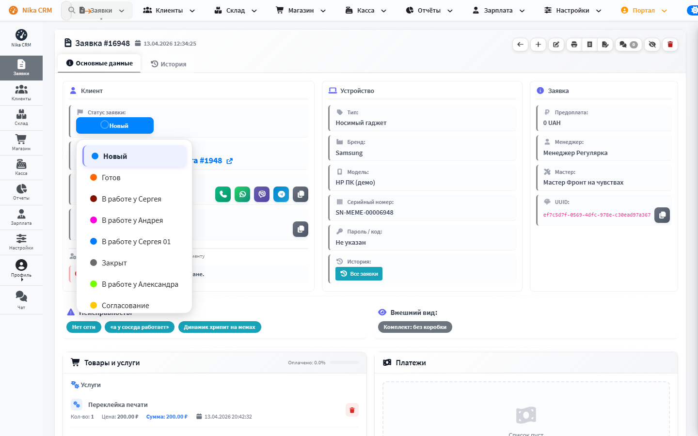

### Важно про зарплату

Начисление при закрытии происходит **один раз** при первом переходе в статус с флагом «начисляет зарплату». Повторное «открыл → закрыл» не должно плодить второе начисление.

---

## 6. Печать документов

После закрытия (или вручную с карточки) доступны:

| Документ | Когда печатать |
|----------|----------------|
| **Квитанция** клиенту | Приём / выдача |
| **Товарный чек** | Продажа запчастей / итоговый чек |
| **Акт выполненных работ** | Закрытие ремонта |
| **Оба документа** | Если выбран режим `both` / кнопка «Оба» |

В модале **«Печать документов»** выберите нужный вариант. Шаблоны правятся в **Настройки → Формы для печати**.

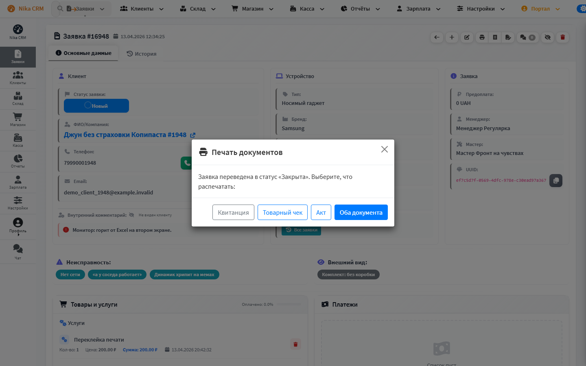

---

## 7. Начисление зарплаты

### Автоматически

Уже произошло на шаге закрытия (§ 5), если статус настроен правильно.

### Где посмотреть

1. Верхнее меню **Зарплата** → **Дашборд зарплаты** → `/salary`.
2. Найдите сотрудника (мастера) за нужный период — колонка **«Начислено»**.
3. Откройте карточку: `/salary/employee/<id>/<role>`.
4. Вкладка **«Начисления»** — строки по заявкам/датам.

На самой заявке также может отображаться блок начислений ЗП.

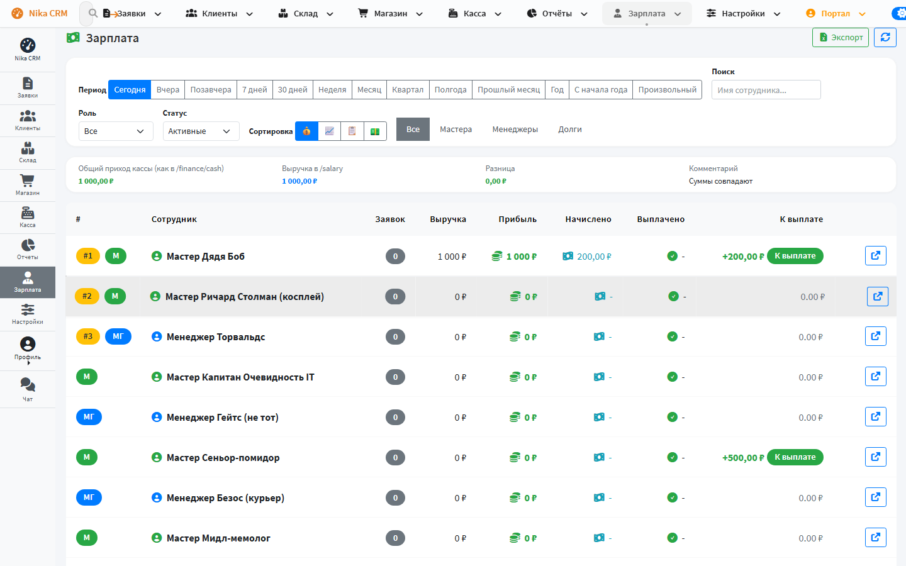

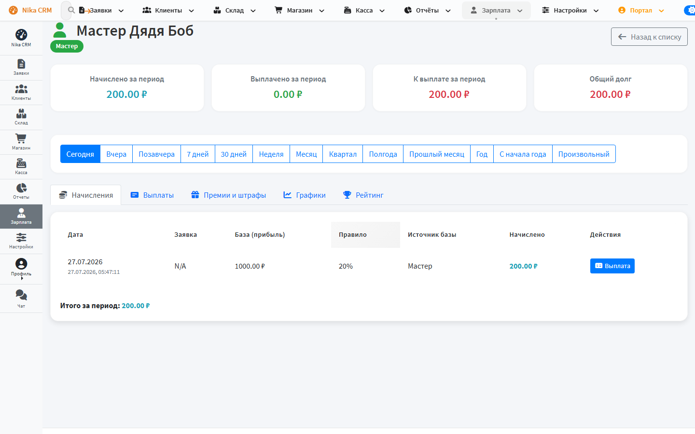

### Если начисления нет

- У статуса закрытия нет флага **«Начисляет зарплату»**.
- Нет привязанного мастера/менеджера в заявке.
- Нет права `salary.view`.
- Заявка ещё не в нужном статусе.

---

## 8. Выплата зарплаты

Начисление ≠ выплата. Деньги сотруднику фиксируются отдельно.

### Шаги

1. **Зарплата** → дашборд → откройте сотрудника.
2. Вкладка **«Выплаты»**.
3. Нажмите **«Зарегистрировать выплату»**  
   *или* у строки начисления кнопку **«Выплата»** (выплата в день закрытия заявки).
4. Укажите сумму, дату, комментарий.
5. Подтвердите **«Зарегистрировать выплату»**.

Долг по зарплате уменьшится. Проверка: **Отчёты → Долги по зарплате** (`/reports/salary-debts`).

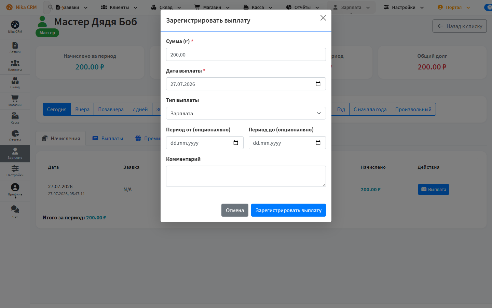

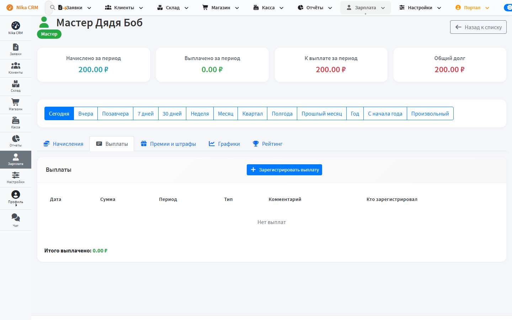

### Связь с кассой

Выплата ЗП обычно должна сопровождаться расходом в кассе (вручную **Касса → Расход** или автоматикой — по вашей версии/настройкам). Сверьте сумму с § 9.

---

## 9. Касса: движение денег

### Путь

**Касса** → **Движение денег** → `/finance/cash`

### Что вы должны увидеть после сценария

| Операция | Откуда появилась |
|----------|------------------|
| Приход (оплата заявки) | § 4 «Добавить оплату» |
| Приход (предоплата) | § 2, если указывали |
| Расход (выплата ЗП) | § 8 + ручной расход, если нужно |
| Расход (возврат) | если делали возврат |

### Ручные операции

1. **Приход** / **Расход** / **Перевод** — кнопки на странице кассы.
2. Укажите сумму, статью (категорию), комментарий, кассу/счёт.
3. Сохраните.

Итоги страницы: **баланс / приход / расход** за выбранный период.

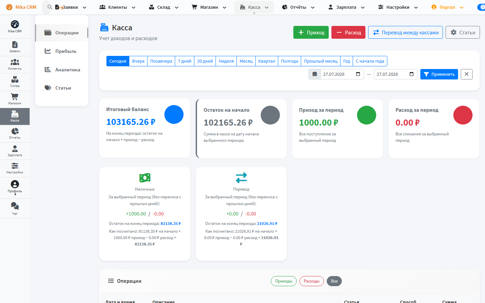

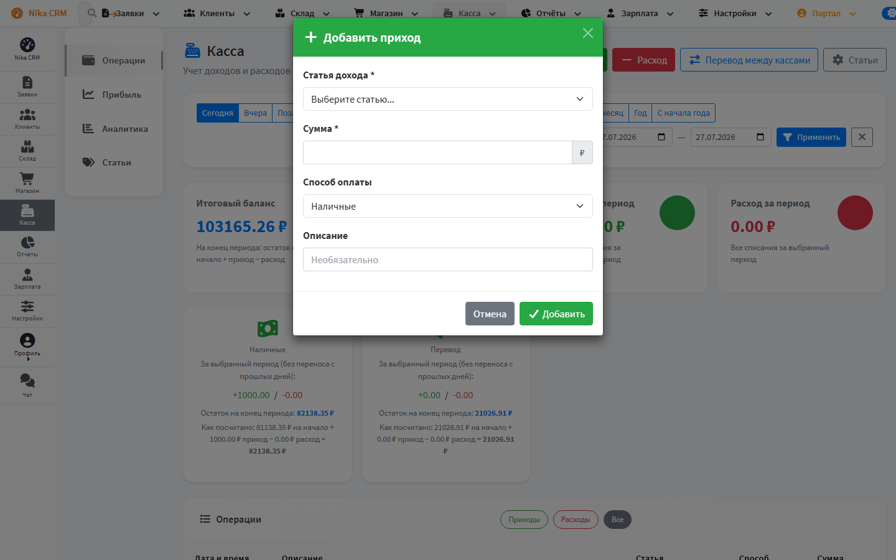

---

## 10. Сводка дня и отчёты

### 10.1. Сводка дня (оперативка директора)

**Отчёты** → **Сводка дня** → `/reports/day`

1. Нажмите **«Сегодня»** или выберите дату → **«Показать»**.
2. Просмотрите блоки: касса за день, заявки, зарплата и др.

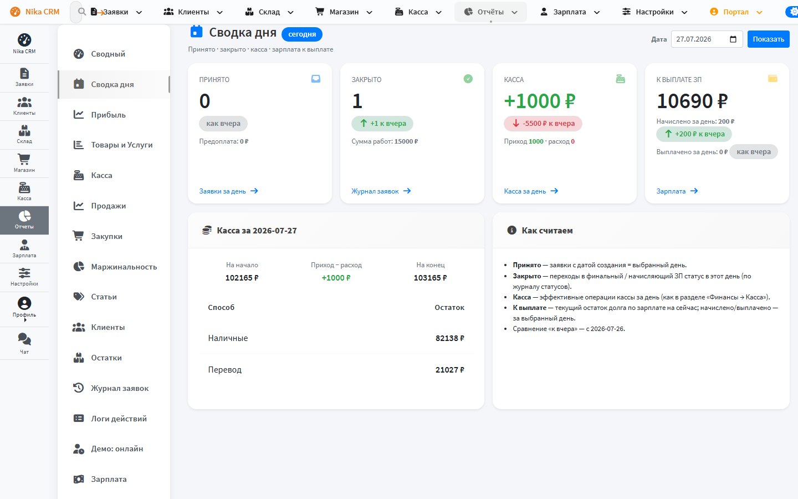

### 10.2. Отчёт по кассе

**Отчёты** → **Касса** → `/reports/cash` — свод оплат и методика расчёта за период.

### 10.3. Отчёт по зарплате

**Отчёты** → **Зарплата** / **Зарплата → Отчёт по зарплате** → `/reports/salary`.

### 10.4. Журнал действий (аудит)

**Отчёты** → **Журнал действий** (в сайдбаре отчётов — «Логи действий») → `/reports/action-logs` — кто что менял.

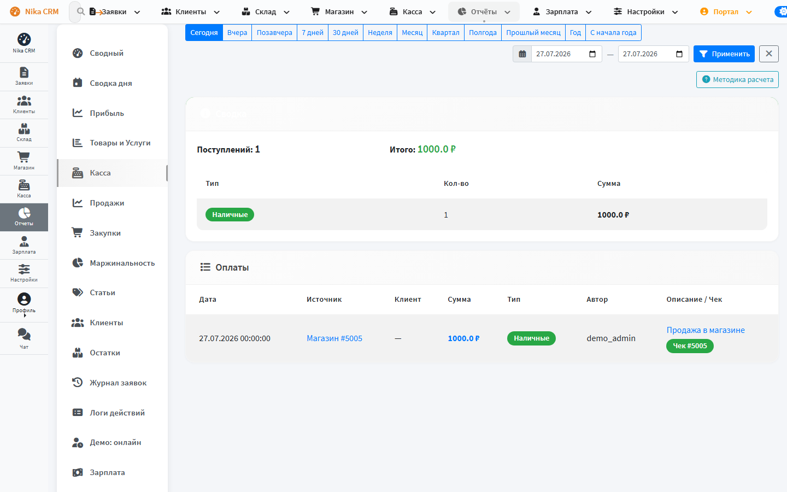

---

## 11. Дополнительно: магазин, закупки, чат

Эти шаги не обязательны для «одной заявки», но часто входят в день СЦ.

### 11.1. Быстрая продажа в магазине

1. **Магазин** → **Продажи** → `/shop`.
2. Добавьте товары в чек → оплата → провести.
3. При необходимости печать товарного чека.
4. Проверьте списание на складе и приход в кассе.

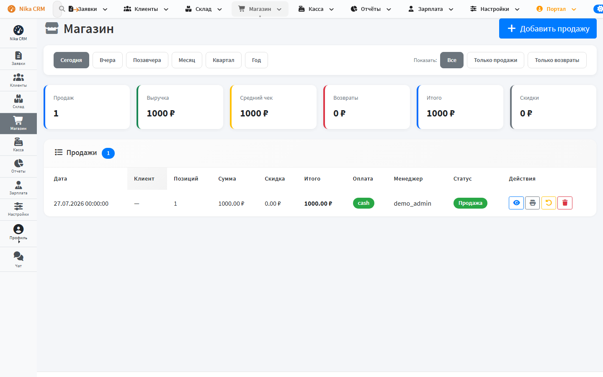

### 11.2. Закупка на склад

1. **Склад** → **Закупки** → `/warehouse/purchases`.
2. Создайте закупку, позиции, поставщика.
3. Завершите закупку → остатки вырастут.
4. При необходимости расход в кассе за оплату поставщику.

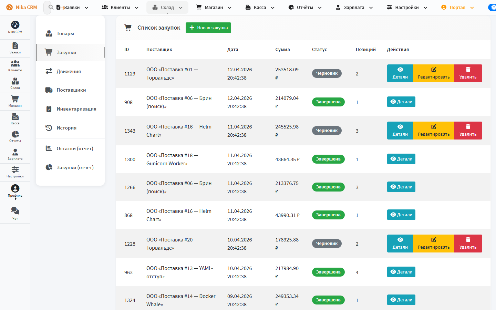

### 11.3. Чат сотрудников

1. В **левом сайдбаре** нажмите **«Чат»**.
2. Укажите подпись «кто вы на этом ПК», если спросили.
3. Напишите коллегам; красный бейдж — непрочитанные.

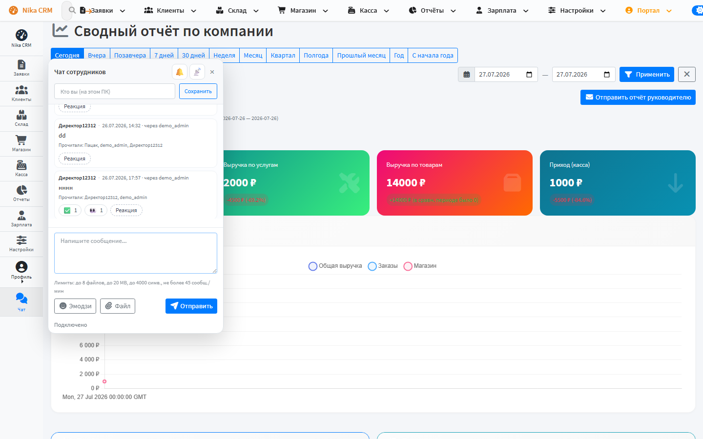

### 11.4. Закрепление важной заявки

В **Заявки → Список заявок** нажмите **«Закрепить»** — заявка поднимется вверх у всех сотрудников.

---

## 12. Чек-лист конца дня

- [ ] Все выданные клиентам заказы в статусе **Закрыта**
- [ ] Оплаты по закрытым заявкам проведены (§ 4)
- [ ] Начисления ЗП видны на дашборде (§ 7)
- [ ] Фактические выплаты сотрудникам зарегистрированы (§ 8)
- [ ] **Касса → Движение денег** сходится с наличкой в ящике (§ 9)
- [ ] **Сводка дня** просмотрена (§ 10)
- [ ] Расходники/закупки оприходованы, если были (§ 11.2)
- [ ] Нет «висящих» заявок в «Готова» без звонка клиенту

---

## Скриншоты

### Могу ли я сам сделать скриншоты?

| Способ | Да/нет | Комментарий |
|--------|--------|-------------|
| Сгенерировать «фейковый» UI картинкой | **Нет (не делаем)** | Вводит в заблуждение |
| Снять реальный UI автоматически | **Да, скриптом** | Нужен запущенный CRM + Playwright |
| Снять вручную вами | **Да** | Win+Shift+S / ScrLng → положить файлы в папку |

В этой сессии агента **нет встроенного браузера** для кликов по CRM. Поэтому гайд подготовлен с **плейсхолдерами**; картинки добавляются после съёмки.

### Куда класть файлы

Каталог: `docs/assets/walkthrough/`

Имена файлов — как в ссылках выше, например:

```
01-login.png
02-dashboard.png
…
23-staff-chat.png
```

Рекомендуемый размер: ширина ~1200–1600 px, формат PNG или WebP.

### Автосъёмка (Playwright)

1. Установите зависимости один раз:
   ```powershell
   .\venv\Scripts\pip.exe install playwright
   .\venv\Scripts\playwright.exe install chromium
   ```
2. Запустите CRM (`python run.py`) или укажите URL демо.
3. Выполните:
   ```powershell
   .\venv\Scripts\python.exe scripts\capture_walkthrough_screenshots.py --base-url http://127.0.0.1:5000 --user admin --password 111111
   ```
4. Скрипт сохранит PNG в `docs/assets/walkthrough/`.  
   Пример для публичного демо:
   ```powershell
   .\.venv-win\Scripts\python.exe scripts\capture_walkthrough_screenshots.py --base-url https://demo.nika-sc.ru --user demo_admin --password Demo2026!
   ```
   Модалки «добавить услугу / оплату» при тяжёлой странице заявки могут потребовать досъёмки — см. лог скрипта.

---

## Краткая схема потока денег и ЗП

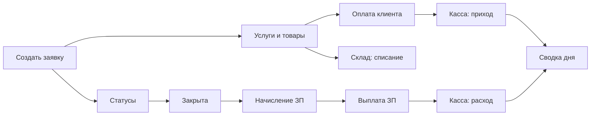
```mermaid
flowchart LR
  A[Создать заявку] --> B[Услуги и товары]
  B --> C[Оплата клиента]
  C --> D[Касса: приход]
  B --> E[Склад: списание]
  A --> F[Статусы]
  F --> G[Закрыта]
  G --> H[Начисление ЗП]
  H --> I[Выплата ЗП]
  I --> J[Касса: расход]
  D --> K[Сводка дня]
  J --> K
```

---

*Документ можно дополнять скриншотами без правки текста — достаточно положить файлы с теми же именами в `docs/assets/walkthrough/`.*
